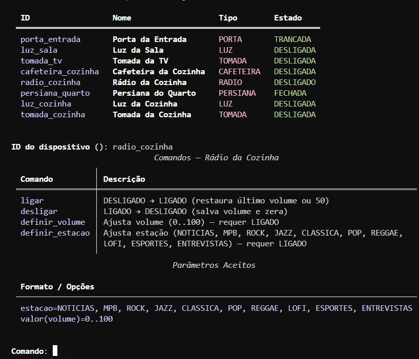

# Smart Home Hub


Sistema de automação residencial em Python.

## Objetivo
Hub capaz de gerenciar dispositivos domésticos (porta, luz, tomada inteligente, cafeteira, persiana, rádio etc.), executando comandos, rotinas e gerando relatórios a partir dos logs. O projeto aplica conteúdos da disciplina:
- Programação Orientada a Objetos (dispositivos com FSM)
- Máquina de estados com `transitions`
- Padrões de projeto: Observer, Singleton (logger), Factory/Facade
- Programação funcional em relatórios (map/filter/reduce, comprehensions)
- Persistência em JSON (config) e CSV (logs + relatórios)
- Enums e propriedades (validação de atributos); exceções customizadas

## 1. Estrutura de Pastas
```
SMART-HOME-HUB/
├── .venv/
├── data/
│ ├── logs/
│ ├── reports/
│ └── config.json
├── images/
├── smart_home/
│ ├── __init__.py
│ ├── core/
│ │ ├── __init__.py
│ │ ├── cli.py                # CLI interativa (Rich)
│ │ ├── hub.py                # gerenciamento (serviço)
│ │ ├── dispositivos.py       # classe base + enums
│ │ ├── eventos.py            # tipos de eventos do hub
│ │ ├── observers.py          # observers (console/CSV)
│ │ ├── logger.py             # singleton de logging CSV
│ │ ├── persistencia.py       # carregar/salvar JSON
│ │ ├── erros.py              # exceções personalizadas
│ │ ├── relatorios.py         # funções de relatório
│ │ └── relatorios_demo.py    # geração em lote (exemplos)
│ └── dispositivos/
│   ├── __init__.py
│   ├── porta.py
│   ├── luz.py
│   ├── tomada.py
│   ├── cafeteira.py
│   ├── persiana.py
│   └── radio.py
├── .gitignore
├── README.md
└── requirements.txt
```
---
## 2. Execução Rápida
Pré-requisitos: Python 3.10+

Ambiente (Windows PowerShell):
```powershell
py -3 -m venv .venv
.\.venv\Scripts\Activate.ps1
pip install -r requirements.txt
```

Inicie o hub (com config padrão):
```powershell
python -m smart_home.core.cli
```

Ou informando o JSON de configuração:
```powershell
python -m smart_home.core.cli --config data\config.json
```


---
## 3. CLI (Menu Interativo)
Menu principal:
```
1 Listar dispositivos
2 Mostrar dispositivo (atributos)
3 Executar comando em dispositivo
4 Alterar atributo de dispositivo
5 Executar rotina configurada
6 Gerar relatório (submenu)
7 Salvar configuração
8 Adicionar dispositivo
9 Remover dispositivo
10 Sair
```

Exemplo — lista de dispositivos:


### 3.1 Exemplos de Uso
Adicionar uma luz:
```
8 → tipo=LUZ → id=luz_sala → nome="Luz da Sala" → brilho inicial / cor
```
Definir brilho e cor (a luz precisa estar LIGADA):
```
3 → selecionar luz_sala → comando=ligar
3 → selecionar luz_sala → comando=definir_brilho → param: valor=70
3 → selecionar luz_sala → comando=definir_cor → param: cor=QUENTE
```

Exemplo — executar comando em dispositivo:


Abrir parcialmente a persiana:
```
3 → persiana_quarto → comando=ajustar → param: percentual=40
```
Preparar café:
```
3 → cafeteira_cozinha → ligar
3 → cafeteira_cozinha → preparar_bebida
3 → cafeteira_cozinha → finalizar_preparo
```

Exemplo — escolher e executar rotina:


### 3.2 Submenu de Relatórios (opção 6)
Relatórios disponíveis:


1 Consumo por tomada (Wh)
2 Tempo total luzes ligadas
3 Top dispositivos mais usados
4 Cafés por dia
5 Distribuição de comandos por tipo
6 Resumo agregado (combina os anteriores)

Durante a geração pode-se informar período (datetime ISO) ou deixar vazio para todo histórico.

Exemplo — relatório geral:


---
## 4. Formatos de Logs (CSV)
### 4.1 transitions.csv
Transições reais de estado:
```
timestamp,id_dispositivo,evento,estado_origem,estado_destino
2025-09-15T10:01:22,luz_sala,ligar,desligada,ligada
```
### 4.2 commands.csv
Comandos executados (incluindo redundantes/bloqueados já normalizados pela lógica interna):
```
timestamp,id_dispositivo,comando,estado_origem,estado_destino
2025-09-15T10:02:01,luz_sala,definir_brilho,ligada,ligada
```
### 4.3 events.csv
Todos eventos agregados (tipo + payload simplificado):
```
timestamp,tipo,id,extra
2025-09-15T10:02:01,COMANDO_EXECUTADO,luz_sala,{"comando":"definir_brilho","antes":"LIGADA","depois":"LIGADA"}
```

---
## 5. Relatórios (Funções em `relatorios.py`)
| Função | Descrição | Técnicas FP |
|--------|-----------|-------------|
| `consumo_por_tomada` | Calcula Wh por tomada (a partir de transições LIGADA/DESLIGADA) | reduce, comprehensions |
| `tempo_total_luzes_ligadas` | Soma segundos ligada por luz | filter, list comprehension |
| `dispositivos_mais_usados` | Ranking de eventos (transições + comandos) | sorted, slicing |
| `cafes_por_dia` | Agrupa preparos de café por dia | group logic + comprehensions |
| `distribuicao_comandos_por_tipo` | Frequência por tipo de dispositivo | mapping + reduce |
| `resumo` | Agrega todos em um único dicionário | composição |

### 5.1 CSVs Gerados (padrão `report_*.csv`)
```
report_consumo_wh.csv
report_tempo_luzes.csv
report_top_dispositivos.csv
report_cafes_por_dia.csv
report_dist_comandos_tipo.csv
```
Exemplo `report_consumo_wh.csv`:
```
id_dispositivo,potencia_w,horas_ligada,total_wh,inicio_periodo,fim_periodo
tomada_tv,120,2.500,300.00,2025-09-15T00:00:00,2025-09-15T23:59:59
__TOTAL__,,,300.00,2025-09-15T00:00:00,2025-09-15T23:59:59
```

### 5.2 Script em Lote
Gerar todos diretamente (útil para avaliação):
```bash
python -m smart_home.core.relatorios_demo
```

---
## 6. Persistência (config.json)
O arquivo `data/config.json` guarda:
```
{
	"hub": { "nome": "Casa Inteligente", "versao": "1.0" },
	"dispositivos": [
		{ "id": "porta_entrada", "tipo": "PORTA", "nome": "Porta de Entrada", "estado": "TRANCADA", "atributos": {} },
		{ "id": "luz_sala", "tipo": "LUZ", "nome": "Luz da Sala", "estado": "DESLIGADA", "atributos": { "brilho": 70, "cor": "QUENTE" } },
		{ "id": "tomada_tv", "tipo": "TOMADA", "nome": "Tomada TV", "estado": "DESLIGADA", "atributos": { "potencia_w": 120 } },
		{ "id": "cafeteira_cozinha", "tipo": "CAFETEIRA", "nome": "Cafeteira", "estado": "DESLIGADA", "atributos": {} }
	],
	"rotinas": {
		"acordar": [
			{ "id": "luz_sala", "comando": "ligar", "argumentos": { "valor": 50 } },
			{ "id": "cafeteira_cozinha", "comando": "preparar_bebida" },
			{ "id": "persiana_quarto", "comando": "abrir" }
		],
		"modo_noite": [
			{ "id": "porta_entrada", "comando": "trancar" },
			{ "id": "luz_sala", "comando": "desligar" }
		]
	}
}
```
Salvar manualmente via menu (opção 7) ou ao sair (confirmação).

---
## 7. Rotinas
Definidas em `config.json` em `rotinas` (lista de passos com `id` + `cmd`). Ao executar:
- Mostra barra de progresso
- Exibe tabela com resultado de cada passo (antes/depois/erro)

Exemplo de passos:
```
"noite": [
	{"id": "luz_sala", "cmd": "desligar"},
	{"id": "persiana_quarto", "cmd": "fechar"},
	{"id": "radio_sala", "cmd": "desligar"}
]
```

---
## 8. Dispositivos & Atributos
| Tipo | Estados | Comandos Principais | Atributos Editáveis |
|------|---------|---------------------|---------------------|
| LUZ | DESLIGADA/LIGADA | ligar, desligar, definir_brilho(valor), definir_cor(cor) | brilho (0-100), cor (QUENTE/FRIA/NEUTRA) |
| TOMADA | DESLIGADA/LIGADA | ligar, desligar | potencia_w (fixo), consumo (derivado) |
| CAFETEIRA | DESLIGADA/PRONTA/PREPARANDO/SEM_RECURSOS | ligar, desligar, preparar_bebida, finalizar_preparo, reabastecer_maquina | (recursos internos) |
| RÁDIO | DESLIGADO/LIGADO | ligar, desligar, definir_volume(valor), definir_estacao(estacao) | volume (0-100), estacao (10 opções) |
| PERSIANA | FECHADA/PARCIAL/ABERTA | abrir, fechar, ajustar(percentual) | abertura (0-100) |
| PORTA | TRANCADA/DESTRANCADA/ABERTA | destrancar, trancar, abrir, fechar | tentativas_invalidas (derivado) |

### 8.1 FSMs Obrigatórias (especificação)
- Porta: trancada ↔ destrancada ↔ aberta
	- destrancar: trancada → destrancada
	- trancar: destrancada → trancada (bloqueado se aberta)
	- abrir: destrancada → aberta
	- fechar: aberta → destrancada
- Luz: off/on
	- ligar: off → on; desligar: on → off
	- definir_brilho(valor 0–100): on → on; definir_cor(COR): on → on
- Tomada: off/on
	- ligar/desligar como acima; consumo estimado (Wh) por intervalos ligada

---
## 9. Exemplo de Saída (Resumo Agregado)
Comando no submenu (opção 6 → 6 Resumo agregado):
```
Consumo Tomadas
ID         Wh
tomada_tv  300.00

Top Uso
ID         Eventos
luz_sala   12
...
```

---
## 10. Programação Funcional
Trechos ilustrativos (ver código para detalhes):
```python
# reduce para total de consumo
total_wh = reduce(lambda acc, r: acc + r["total_wh"], linhas, 0.0)

# list comprehension para projetar períodos de luz
res = [{"id_dispositivo": k, "segundos_ligada": v, "hhmmss": _fmt(v)} for k, v in acumulado.items()]
```

---
## 11. Exceções e Tratamento de Erros
- Base: `SmartHomeError`
- Validações: `AtributoInvalido`, `ComandoInvalido`, `ErroDeValidacao`
- Persistência: `ConfigInvalida`
- Entidades: `DispositivoNaoEncontrado`, `DispositivoJaExiste`, `RotinaNaoEncontrada`
Os erros são exibidos no CLI e logados quando relevante.

---
## 12. Padrões de Projeto
- Observer: console e CSVs (transitions, events, commands)
- Singleton: logger CSV
- Factory/Facade: criação de dispositivos no Hub; Hub como fachada de serviço

---


